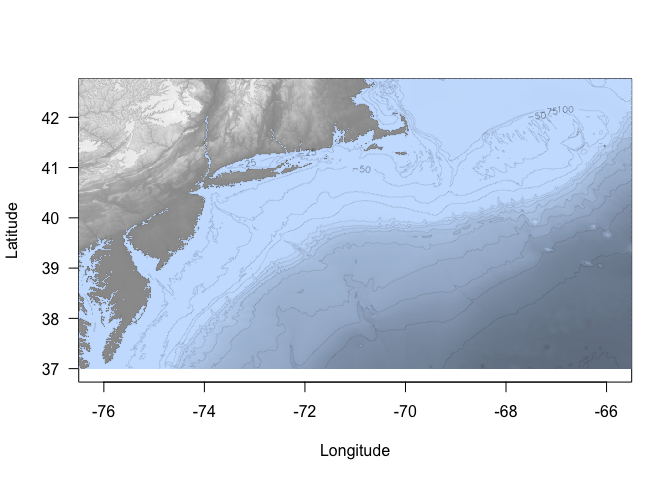
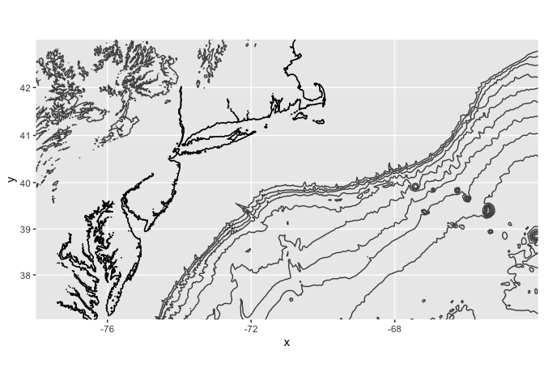
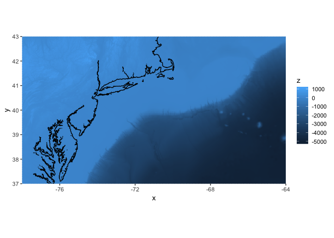
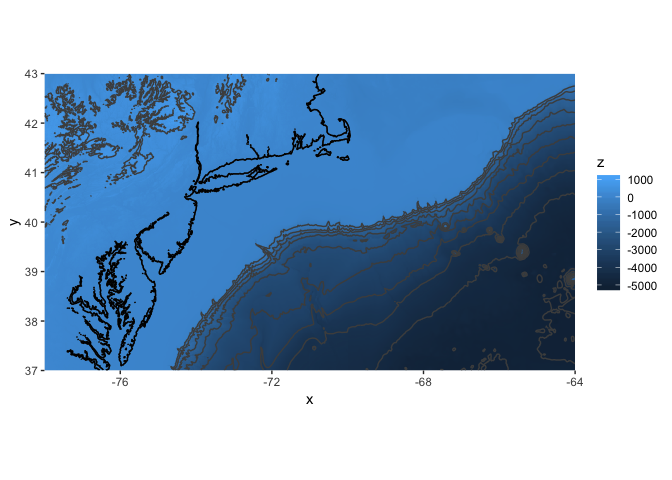
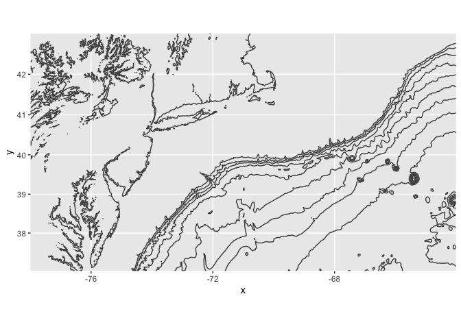
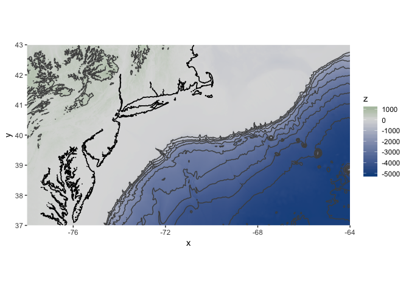
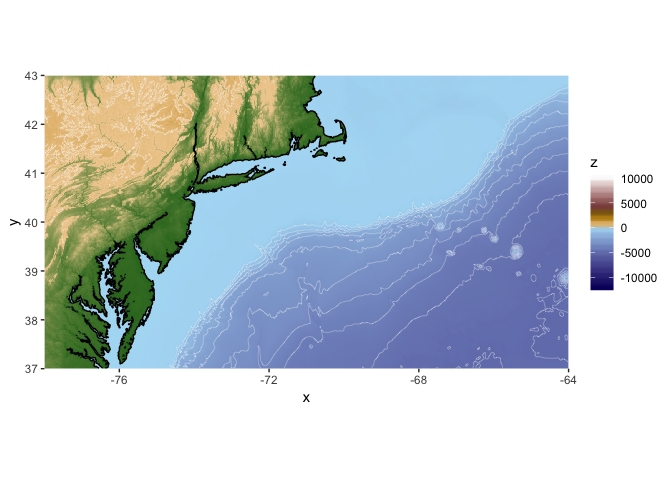
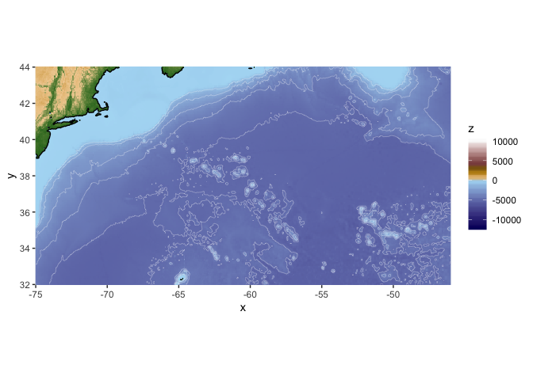
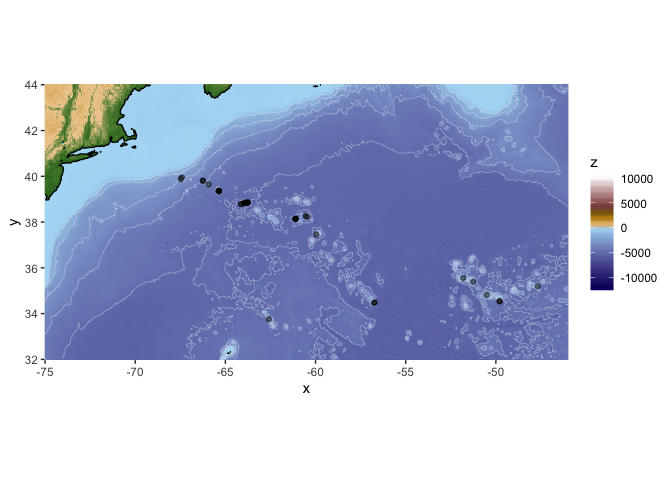
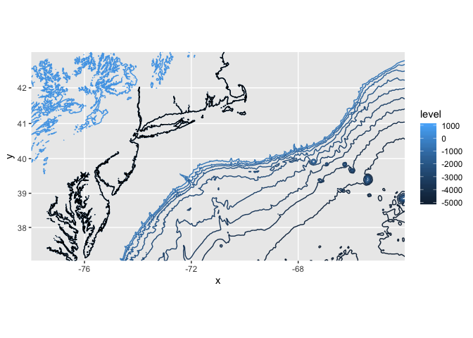

Sarah's map
================

``` r
pacman::p_load(marmap, mapdata, RColorBrewer, classInt, ggplot2, install = FALSE)
# library(marmap)
# library(mapdata)
# library(RColorBrewer)
# library(classInt)
# library(ggplot2)
```

Get data
========

-   These numbers are the western longitude, the eastern longitude, the southern latitude and the northern latitude.
-   getNOAA.bathy is from the marmap package.

``` r
dat <- getNOAA.bathy(-78,-64,37,43,res=1, keep=TRUE)
```

    ## File already exists ; loading 'marmap_coord_-78;37;-64;43_res_1.csv'

``` r
data(nw.atlantic)
atl <- as.bathy(nw.atlantic)
```

Create color palettes
=====================

``` r
blues <- c("lightsteelblue4", "lightsteelblue3", "lightsteelblue2", "lightsteelblue1")
greys <- c(grey(0.6), grey(0.93), grey(0.99))
```

Plot data
=========

``` r
plot(dat
     # set x and y axis limits
     , xlim=c(-76.5,-65.5)
     , ylim=c(38,41.5)
     # im plots the terrain image
     ,im=TRUE
     # plots land as grey and sea as blue?  looks like it changes where the land sea boundary is
     , land=TRUE
     # add in color palettes defined above - defines blues as sea and greys as land, c(low point, high point, color) where in this line, the lows are darkest, with 0 (beach) being lightest and for land the lows are lightest and mountains are lightest.
     , bpal=list(c(min(dat),0,blues),c(0,max(dat),greys))
     # lwd controls the alpha of the contour lines, but not the bathymetric contour lines, it looks like there are 2 sets here.
     , lwd=.09
     # las = include more axis labels?
     , las=1
     # percent size of the axis titles
     # ,cex.lab=1.75
     # percent size of the tick labels
     # , cex.axis=1.75
     # no apparent what this one does but it must be size somehow - probably main title which is lacking here
     # , cex.main=1.75
     # no apparent what this one does but it must be size somehow - probably subtitle which is lacking here
     # , cex.sub=1.75 
     )

# this plots the border between land and sea
# map("worldHires", res=0, lwd=0.7, add=TRUE)
# these plot the contour lines
plot(dat, deep=-25, shallow=-25, step=0, lwd=0.1, drawlabel=TRUE, add=TRUE)
plot(dat, deep=-50, shallow=-50, step=0, lwd=0.1, drawlabel=TRUE, add=TRUE)
plot(dat, deep=-75, shallow=-75, step=0, lwd=0.1, drawlabel=TRUE, add=TRUE)
plot(dat, deep=-100, shallow=-100, step=0, lwd=0.1, drawlabel=TRUE, add=TRUE)
```

 Can we ggplot this? [Directions](https://rdrr.io/cran/marmap/man/autoplot.bathy.html)

-   plot the original contours and map borders

``` r
autoplot(dat)
```

 - plot the tile - color shade of depth

``` r
autoplot(dat, geom = c("tile"))
```



-   plot both!

``` r
autoplot(dat, geom=c("raster", "contour"))
```


``` r
  # geom names can be abbreviated
autoplot(dat, geom=c("r", "c"))
```



-   do not highlight the coastline

``` r
autoplot(dat, coast=FALSE)
```



-   better colour scale

``` r
autoplot(dat, geom=c("r", "c")) +
  scale_fill_gradient2(low="dodgerblue4", mid="gainsboro", high="darkgreen")
```



-   set aesthetics - even though it gives and "unknown", it changes the contour lines to a 0.1px white line

``` r
autoplot(dat, geom=c("r", "c"), colour="white", size=0.1)
```

    ## Warning: Ignoring unknown parameters: colour, size


-   topographical colour scale, see ?scale\_fill\_etopo

``` r
autoplot(dat, geom=c("r", "c"), colour="white", size=0.1) + 
  scale_fill_etopo()
```

    ## Warning: Ignoring unknown parameters: colour, size



``` r
autoplot(atl, geom=c("r", "c"), colour="white", size=0.1) + 
  scale_fill_etopo()
```

    ## Warning: Ignoring unknown parameters: colour, size



-   add sampling locations

``` r
data(metallo)

last_plot() + geom_point(aes(x=lon, y=lat), data=metallo, alpha=0.5)
```



-   an alternative contour map making use of additional mappings
-   see ?stat\_contour in ggplot2 to understand the ..level.. argument

``` r
autoplot(dat, geom="contour", mapping=aes(colour=..level..))
```


